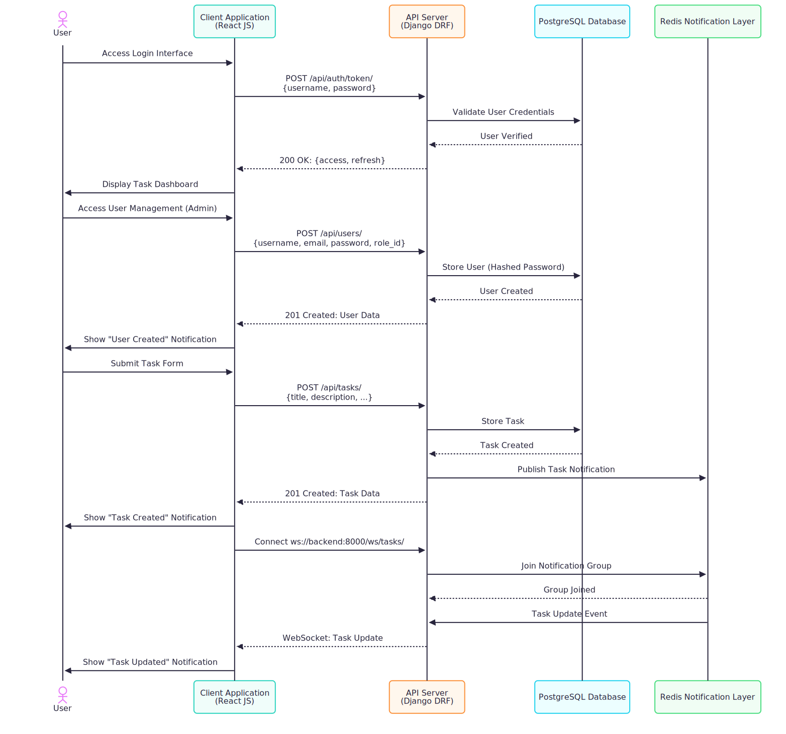
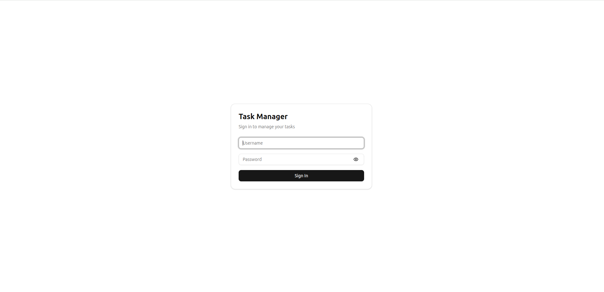
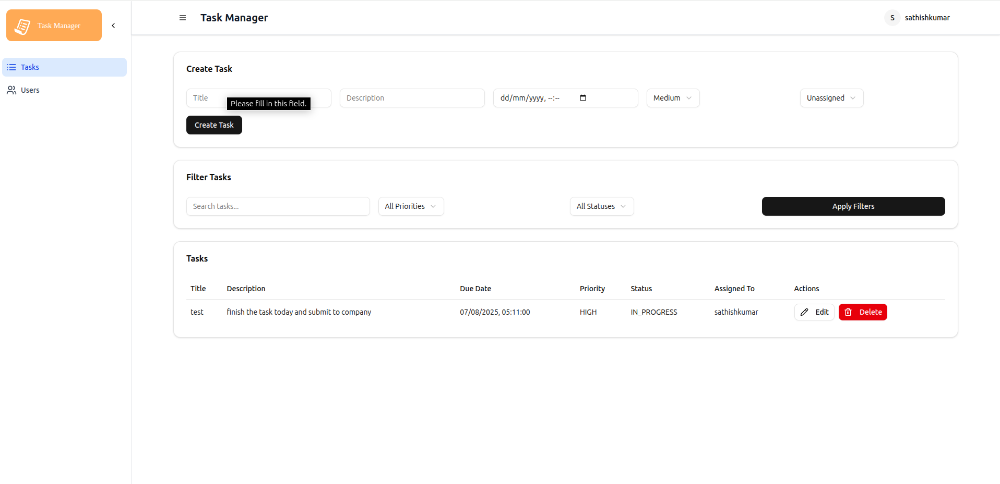
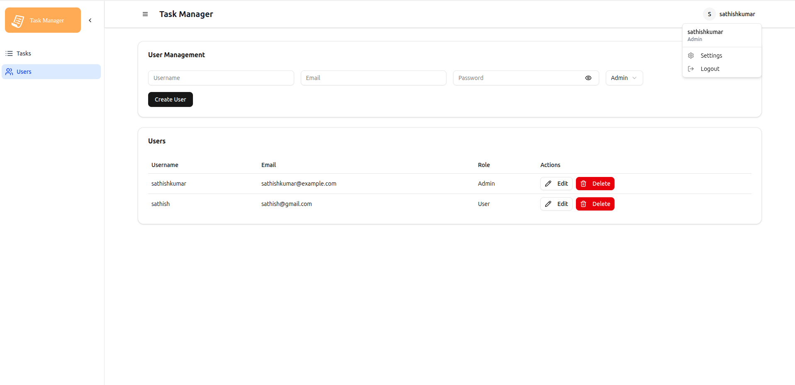

# Advanced Tasks Management

This is a simple task management application built with React, TypeScript, and Tailwind CSS. It allows users to create, update, and delete tasks, as well as manage their authentication state.

## Features

- User authentication with JWT tokens
- Task management (CRUD operations)
- Responsive design using Tailwind CSS

## Technologies Used

- React
- TypeScript
- Tailwind CSS
- Axios for API requests
- Django REST Framework for the backend
- PostgreSQL for the database

## Setup Instructions

1.  Clone the repository:
    ```bash
    git clone <repository-url>
    cd task-management-app
    ```
2.  Docker setup:

    - Ensure Docker is installed and running.

      - Build the Docker images:

        ```bash
        docker-compose build
        ```

      - Start the services:

        ```bash
        docker-compose up
        ```

      - Initialize Superuser Account:

        After the services are up, you need to create a superuser account for the Django admin interface. You can do this by running the following command in a separate terminal:

        ```bash
        docker-compose exec backend python manage.py createsuperuser
        ```

        using curl inintialize the superuser account:

        ```bash
        curl -X POST http://localhost:8000/api/initialize-superuser/ -H "Content-Type: application/json" -d '{"username": "admin", "password": "zaqwer321!", "email": "admin@example.com"}'
        ```

go to `http://localhost:3000` in your browser to access the application.
login with the credentials:

- Username: `admin`
- Password: `zaqwer321!`

# Architecture Overview

## Frontend (React TypeScript)

The React frontend (http://localhost:3000) uses Login.tsx to authenticate users, UserManagement.tsx for admin user creation, and TaskManagement.tsx for task management. localstorage tokens/role, and @tanstack/react-query handles API calls to /api/users/ and /api/tasks/. The UI, built with shadcn/ui and Tailwind CSS, connects to WebSocket (ws://backend:8000/ws/tasks/) for real-time task updates.

## Backend (Django DRF)

The Django backend with DRF provides REST APIs: /api/auth/token/ for JWT login, /api/users/ for user CRUD (admin-only), and /api/tasks/ for task CRUD. Role-based permissions ensure admins manage users, admins/task managers edit tasks, and users view assigned tasks. Data is stored in PostgreSQL, and WebSocket notifications are sent via Redis.

## Redis (Channels)

Redis, configured as the channel layer (CHANNEL_LAYERS), supports WebSocket communication. The TaskConsumer in consumers.py handles connections at ws://backend:8000/ws/tasks/, sending task update messages to the frontend when tasks are created, updated, or deleted.

## Database (PostgreSQL)

PostgreSQL stores User, Role, and Task data. Users are saved with hashed passwords (pbkdf2_sha256), roles define access (admin, task manager, user), and tasks link to users. It supports authentication and role-based task filtering.

# Flow Diagram



# Task Manager Screenshots

some screenshots of the task manager application:

## Login Screen

login screen allows users to authenticate themselves before accessing the application.


## Task List

list screen displays all tasks, allowing users to view and manage their tasks.


## User Management

user management screen allows admins to create, update, and delete user accounts.

